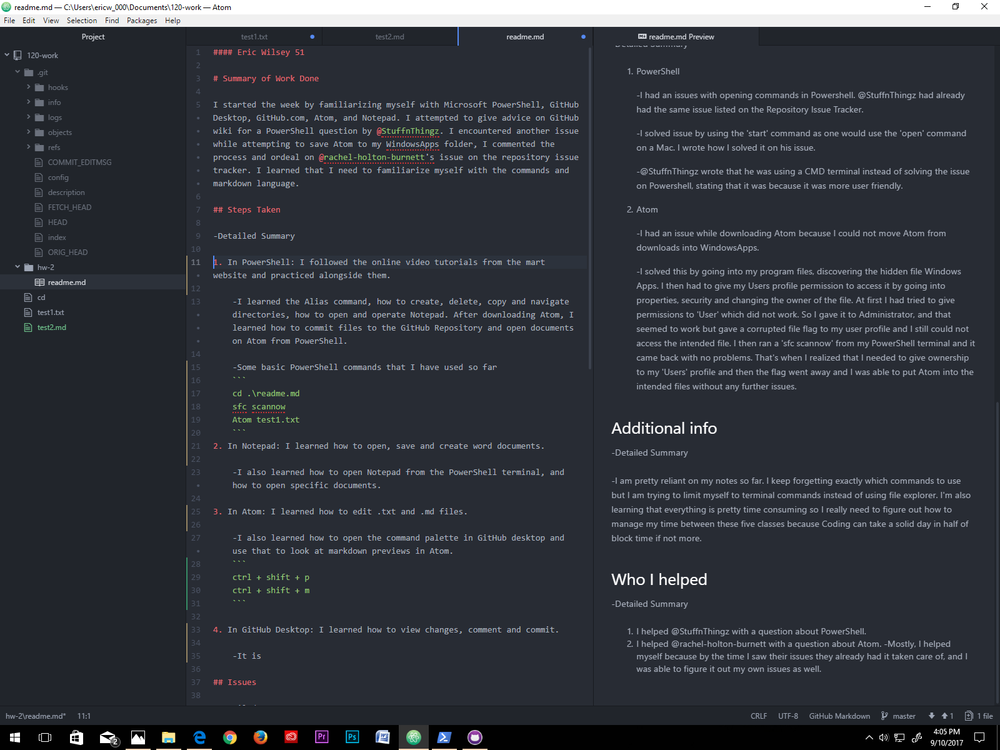

#### Eric Wilsey 51

# Summary of Work Done

I started the week by familiarizing myself with Microsoft PowerShell, GitHub Desktop, GitHub.com, Atom, and Notepad. I attempted to give advice on GitHub wiki for a PowerShell question by @StuffnThingz. I encountered another issue while attempting to save Atom to my WindowsApps folder and commented the process and ordeal on @rachel-holton-burnett's issue on the repository issue tracker. I learned that I need to familiarize myself with the commands and markdown language.

## Steps Taken

- Detailed Summary

 1. In PowerShell: I followed the online video tutorials from the mart website and practiced alongside them.

    - I learned the Alias command, how to create, delete, copy and navigate directories, how to open and operate Notepad. After downloading Atom, I learned how to commit files to the GitHub Repository and open documents on Atom from PowerShell.

    - Some basic PowerShell commands that I have used so far
    ```
    cd .\readme.md
    sfc scannow
    Atom test1.txt
    ```
 2. In Notepad: I learned how to open, save and create word documents.

    - I also learned how to open Notepad from the PowerShell terminal, and how to open specific documents.

 3. In Atom: I learned how to edit .txt and .md files.

    - I also learned how to open the command palette in GitHub desktop and use that to look at markdown previews in Atom.
    ```
    ctrl + shift + p
    ctrl + shift + m
    ```

 4. In GitHub Desktop: I learned how to view changes, comment and commit.

    - It is a little easier than terminal commands.

## Issues

- Detailed Summary

 1. PowerShell

    - I had an issues with opening commands in Powershell. @StuffnThingz had already had the same issue listed on the Repository Issue Tracker.

      - I solved the issue by using the 'start' command as one would use the 'open' command on a Mac. I wrote how I solved it on his issue.

      - @StuffnThingz wrote that he was using a CMD terminal instead of solving the issue on Powershell, stating that it was because it was more user friendly.

 2. Atom

    - I had an issue while downloading Atom because I could not move Atom from downloads into WindowsApps.

      - I solved this by going into my program files, discovering the hidden file Windows Apps. I then had to give my Users profile permission to access it by going into properties, security and changing the owner of the file. At first I had tried to give permissions to 'User' which did not work. So I gave it to Administrator, and that seemed to work but gave a corrupted file flag to my user profile and I still could not access the intended file. I then ran a 'sfc scannow' from my PowerShell terminal and it came back with no problems. That's when I realized that I needed to give ownership to my 'Users' profile and then the flag went away and I was able to put Atom into the intended files without any further issues.

## Additional info

  - Detailed Summary

   - I am very much reliant on my notes. I keep forgetting exactly which commands to use but I am trying to limit myself to terminal commands instead of using file explorer. I'm also learning that everything in this class is pretty time consuming so I really need to figure out how to manage my time better between this and all of my other classes.

   - Here is the image of my editor.

  

   - Here is a link to this Homework.
    
      [markdown readme](https://github.com/ewilsey/120-work/blob/master/hw-2/readme.md)

## Who I helped

  -Detailed Summary

  1. I helped @StuffnThingz with a question about PowerShell.
  2. I helped @rachel-holton-burnett with a question about Atom.

      - Mostly, I just helped myself because by the time I saw each of their issues and figured it out, they had too. C'est la vie.
